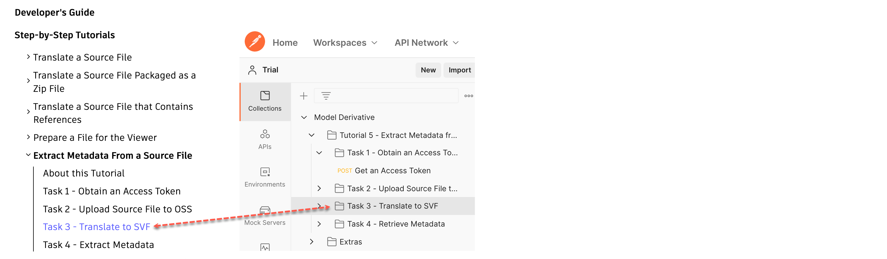
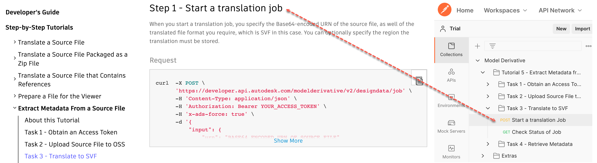

#################################################
Extract Metadata from a Source File
#################################################

.. code-block:: shell

  Use this as a template for the About this tutorial topic of a multi-topic tutorial.
  It is newer and is meant to be accompanied by a Postman Collection

  Guidelines are available at https://wiki.autodesk.com/x/4zsbJg

<*Guidelines are available at* https://wiki.autodesk.com/x/4zsbJg >

*******************
About this tutorial
*******************

When you translate a Model into the SVF (or SVF2) format, the translation process extracts model views (Viewables) so that they can be displayed with the Viewer Library. Additionally, the translation process extracts metadata about the objects in the design. This tutorial demonstrates how to access the metadata that was extracted. This tutorial uses a Revit model, because Revit models contain a rich set of metadata.

For more information about metadata that can be extracted from a manifest, and their significance, see the section on Metadata, under `API Basics`_.

****************
Postman Collection for this tutorial
****************

We also provide a `Postman`_ Collection containing the HTTP requests used in this tutorial. On the Postman Collection, requests are grouped by task. The group has the same name as the corresponding task in this tutorial.

Similarly, requests are named such that you can easily match a Step in this tutorial with the corresponding HTTP request in the Postman Collection.

The Postman Collection is hosted in a `GitHub repository`_, and is accompanied by a set of instructions.

.. _Postman: https://www.getpostman.com/
.. _GitHub repository: https://github.com/Autodesk-Forge/forge-tutorial-postman/tree/master/ModelDerivative_05
.. _API Basics: /en/docs/model-derivative/v2/developers_guide/basics/metadata_extraction/
